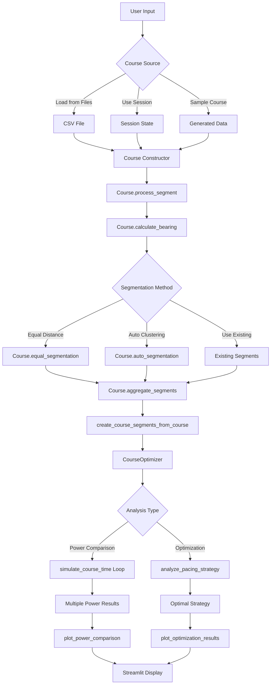

# 📊 Course Optimization Data Flow Diagram

## Overview
This document maps the complete data flow through `03_Course_Optimization.py`, showing how data moves from course loading through optimization analysis.

## 🔄 Data Flow Architecture



## 🔧 Critical Function Usage Map

### 1. **Course Data Processing Chain**
```
📁 Raw Data → 🏗️ Course() → 📊 Segments → ⚡ Optimization
```

#### **Functions Called:**
- `Course.__init__(df)` - Constructor
- `Course.process_segment()` - Distance/gradient calculation  
- `Course.calculate_bearing()` - Direction calculation
- `Course.equal_segmentation(n)` or `Course.auto_segmentation()` - Segmentation
- `Course.aggregate_segments()` - Segment statistics

### 2. **Optimization Data Preparation**
```python
# Line ~257 in 03_Course_Optimization.py
optimization_segments = create_course_segments_from_course(course)
optimizer = CourseOptimizer(critical_power, w_prime)
```

#### **Key Transformation:**
- **Input**: `course.course_segments` (aggregated segment data)
- **Process**: `create_course_segments_from_course()` converts format
- **Output**: DataFrame ready for physics calculations

### 3. **Power Comparison Analysis**
```python
# Lines ~275-290 in 03_Course_Optimization.py
for power in test_powers:
    results, time, w_remaining, energy_used = optimizer.simulate_course_time(
        power, optimization_segments
    )
```

#### **Function Chain:**
1. `CourseOptimizer.simulate_course_time()` - Main simulation
2. `calculate_speed_and_plot()` - Physics calculations per segment
3. W' energy tracking - Anaerobic capacity modeling

### 4. **Optimization Strategy**
```python
# Line ~339 in 03_Course_Optimization.py
analysis = optimizer.analyze_pacing_strategy(optimization_segments)
```

#### **Function Chain:**
1. `CourseOptimizer.analyze_pacing_strategy()` - Main analysis
2. `CourseOptimizer.optimize_constant_power()` - Find optimal power
3. Performance metrics calculation - TSS, IF, etc.

## 📋 Detailed Function Trace

### **Stage 1: Course Loading & Processing**

| Step | Function | Input | Output | Purpose |
|------|----------|-------|--------|---------|
| 1 | `Course.__init__()` | Raw CSV DataFrame | Course object | Initialize course |
| 2 | `Course.process_segment()` | lat/lon/altitude | distance, gradient, cumulative_distance | Calculate segment metrics |
| 3 | `Course.calculate_bearing()` | lat/lon coordinates | bearing angles | Calculate direction |
| 4 | `Course.equal_segmentation()` | number of segments | segment assignments | Divide course |
| 5 | `Course.aggregate_segments()` | individual points | aggregated segment stats | Summarize segments |

### **Stage 2: Optimization Preparation**

| Step | Function | Input | Output | Purpose |
|------|----------|-------|--------|---------|
| 6 | `create_course_segments_from_course()` | `course.course_segments` | optimization DataFrame | Convert format |
| 7 | `CourseOptimizer.__init__()` | critical_power, w_prime | optimizer object | Setup optimizer |

### **Stage 3: Analysis Execution**

| Step | Function | Input | Output | Purpose |
|------|----------|-------|--------|---------|
| 8a | `simulate_course_time()` | power, segments | results, time, w_remaining | Power comparison |
| 8b | `analyze_pacing_strategy()` | segments | complete analysis | Optimization |
| 9 | `calculate_speed_and_plot()` | power, gradient, conditions | speed, physics results | Physics simulation |

### **Stage 4: Visualization**

| Step | Function | Input | Output | Purpose |
|------|----------|-------|--------|---------|
| 10a | `plot_power_comparison()` | power_results dict | Plotly figure | Compare strategies |
| 10b | `plot_optimization_results()` | analysis dict | Plotly figure | Show optimal strategy |

## 🔍 Key Data Transformations

### **Gradient Processing Journey**
```
Raw altitude differences → percentage gradients → decimal gradients → physics calculations
```

1. **`process_segment()`**: `(delta_altitude / distance) * 100` → **percentage** (e.g., 5.0 for 5%)
2. **`aggregate_segments()`**: Average percentages → **aggregated percentages** 
3. **`create_course_segments_from_course()`**: `/ 100` → **decimal** (e.g., 0.05 for 5%)
4. **`calculate_speed_and_plot()`**: Uses decimals for physics

### **Distance Processing Journey**
```
lat/lon coordinates → meters → kilometers → optimization format
```

1. **`process_segment()`**: Geodesic calculation → **meters**
2. **`aggregate_segments()`**: Sum distances, `/1000` → **kilometers**  
3. **`create_course_segments_from_course()`**: `*1000` → **meters** (for physics)

## 🎯 Critical Integration Points

### **Point 1: Course → Optimization Conversion**
```python
# File: app/optimization.py, Line ~235
def create_course_segments_from_course(course):
    segments = course.course_segments.copy()
    return pd.DataFrame({
        'distance': segments['distance_sum'] * 1000,  # km → m
        'gradient': segments['gradient_mean'] / 100,  # % → decimal
        'altitude': segments.get('altitude_mean', 0),
        'wind': 0
    })
```

### **Point 2: Physics Simulation Core**
```python
# File: app/optimization.py, Line ~60-85
def simulate_course_time(self, power, course_segments):
    for _, segment in course_segments.iterrows():
        # 🔥 CRITICAL: This is where physics happens
        speed_calc = calculate_speed_and_plot(
            power, 
            gradient=segment['gradient'],  # Must be decimal!
            v_wind=segment['wind'], 
            altitude=segment['altitude']
        )
        speed = speed_calc['speed_mps']
        time = segment['distance'] / speed
        # W' energy tracking...
```

### **Point 3: Results Display**
```python
# File: pages/03_Course_Optimization.py, Line ~380-390
display_segments['gradient_percent'] = display_segments['gradient'] * 100
# Converts back to percentage for user display
```

## 🐛 Common Issues & Debugging Points

### **Issue 1: Gradient Format Confusion**
- **Symptom**: Impossible gradients (>100%) or unrealistic times
- **Debug Point**: Check `create_course_segments_from_course()` conversion
- **Fix**: Ensure gradients are decimals (0.05) not percentages (5.0) for physics

### **Issue 2: Distance Calculation Errors**
- **Symptom**: Courses appear too short, times too fast
- **Debug Point**: Check `process_segment()` geodesic calculation
- **Fix**: Verify lat/lon → meters conversion accounts for longitude scaling

### **Issue 3: W' Energy Depletion**
- **Symptom**: All power levels show "∞ (Failed)" 
- **Debug Point**: Check `simulate_course_time()` W' tracking
- **Fix**: Ensure power levels are reasonable for course difficulty

## 🔧 Testing & Validation

### **Unit Test Points**
1. **Gradient conversion**: Test percentage ↔ decimal conversion
2. **Distance calculation**: Verify geodesic accuracy  
3. **Physics simulation**: Check speed calculations at known power/gradient
4. **W' energy tracking**: Validate energy depletion/recovery

### **Integration Test Points**
1. **End-to-end flow**: CSV → Course → Optimization → Results
2. **Data consistency**: Verify data types through pipeline
3. **Performance validation**: Check realistic cycling speeds/times

## 📁 File Locations

| Component | File | Key Functions |
|-----------|------|---------------|
| **Main Page** | `pages/03_Course_Optimization.py` | UI, data flow coordination |
| **Course Processing** | `app/course.py` | `Course` class, segmentation |
| **Optimization Engine** | `app/optimization.py` | `CourseOptimizer`, physics integration |
| **Physics Calculations** | `app/cycling_physics.py` | `calculate_speed_and_plot()` |
| **Visualization** | `app/visualizations.py` | Map and chart functions |

This data flow diagram shows how each component connects and where the critical functions are used in the optimization pipeline.
